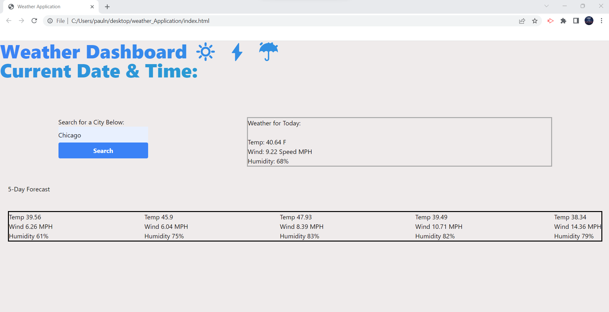

# weather_Application

## Description
This is the UPenn Module 6 Assignment.  The student was tasked to create a website with no pre-written code that uses third-party APIs in order to obtain data pertaining to weather based on the user's input.  The data displayed after the user types in a city will be the current weather plus the 5-day forecast.  

## Code Contributors

The project was completed by each student. This was completed by Paul Nixon.

## User Story

Pre-written code was not provided to the student. The main goal was to implement and practice third party APIs. There was a continued focus on JavaScript.  The user will have the ability to type any city, click search, and receive the weather log for the current day, plus a 5-day weather forecast with temperature, wind, and humidity readings.  

## Acceptance Criteria

The assignment is complete when all aspects of the UPENN Module # Acceptance Criteria points are met.

## Assets
Below is an image of the final project:

## Deployment

URL of the deployed site:  
